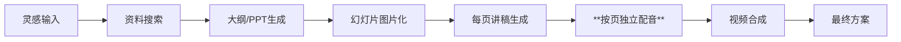

在短视频内容爆发的今天，创作的门槛依然很高。从一个想法到最终成片，往往需要经历**资料搜集、脚本撰写、PPT制作、录音配音、视频剪辑**等繁琐步骤。

为了彻底解放生产力，昨天开发了 **Content Factory（内容工厂）** 技能，今天将其提交到了 [GitHub: bajie-skills](https://github.com/zhchxiao123/bajie-skills/tree/main/content-factory)。这是一个基于 AI Agent 的全自动创作流水线，能实现从“灵光一闪”到“视频出炉”的一条龙服务。

---

## 🎬 实战展示：Claude Code + Content Factory

最近我测试了通过 **Claude Code** 调用该技能的效果。只需一句话指令，Agent 就能自动理解意图并驱动整个流水线。

### 1. 终端自动化执行
下图展示了 Claude Code 在接收到任务后，如何有序地调用搜索、PPT生成、配音等各个模块。


### 2. 最终成品预览
这是流水线最终产出的高清视频，注意其音画同步的精准度。

<video controls width="100%" preload="metadata">
  <source src="/assets/img/content-factory/微信视频2026-04-14_223443_695.mp4" type="video/mp4">
  您的浏览器不支持视频播放。
</video>

---

## 🏗️ 核心工作流解析

内容工厂的设计理念是“模组化”与“高度自动化”。整个流水线分为七个核心阶段：



### 关键环节说明：
1. **智能搜索与整理**：自动整合网络资料，生成结构化的内容摘要。
2. **科技风 PPT 生成**：基于模板自动生成 1920x1080 的高清幻灯片并导出为图片帧。
3. **MiniMax TTS 集成**：使用 MiniMax 最新的语音合成接口，提供极具表现力的口语化配音。

---

## 💎 核心突破：解决“音画同步”难题

在早期的 AI 视频生成尝试中，最大的痛点是**音频与画面对齐**。

### 旧方案的局限：
将整篇讲稿合成一段长音频，然后简单地在总时长基础上平分给每张幻灯片。这导致每页讲完时，画面可能还没切或者已经提前切走，观感极差。

### 内容工厂的优化：**按页独立配音策略**
这是该技能最核心的优化点：
- **解耦生成**：为每张 PPT 幻灯片生成一段独立的音频文件。
- **精确测量**：记录每段音频的真实时长（精确到毫秒）。
- **动态合成**：在最终使用 FFmpeg 合成视频时，**每张幻灯片的显示时长 = 该页配音时长**。

通过这种方案，无论 Agent 写的讲稿是长是短，画面都能与配音做到完美的物理对准。

---

## 📁 输出结构演示

生成的每一个项目都拥有清晰的资产管理结构，方便二次编辑：

```text
output/{topic-slug}/
├── 01_research/      # 原始资料摘要
├── 02_outline/       # 内容大纲
├── 04_slides/        # 高清幻灯片(PNG帧)
├── 05_script/        # 每页独立讲稿(Markdown)
├── 06_audio/         # 每页 MP3 配音及合并后的完整音轨
└── 07_video/         # 最终合成的完美同步视频 (MP4)
```

---

## 🚀 开启你的内容工厂

如果你也想体验这种“全自动出片”的快感，可以访问以下仓库获取源码与 Skill 配置：

🔗 **GitHub 仓库**：[zhchxiao123/bajie-skills/content-factory](https://github.com/zhchxiao123/bajie-skills/tree/main/content-factory)

> [!TIP]
> 使用前需要配置 `MINIMAX_API_KEY` 环境变量。推荐使用的音色 ID 为 `male-qn-qingse`（清澈男声），非常适合技术讲解。
