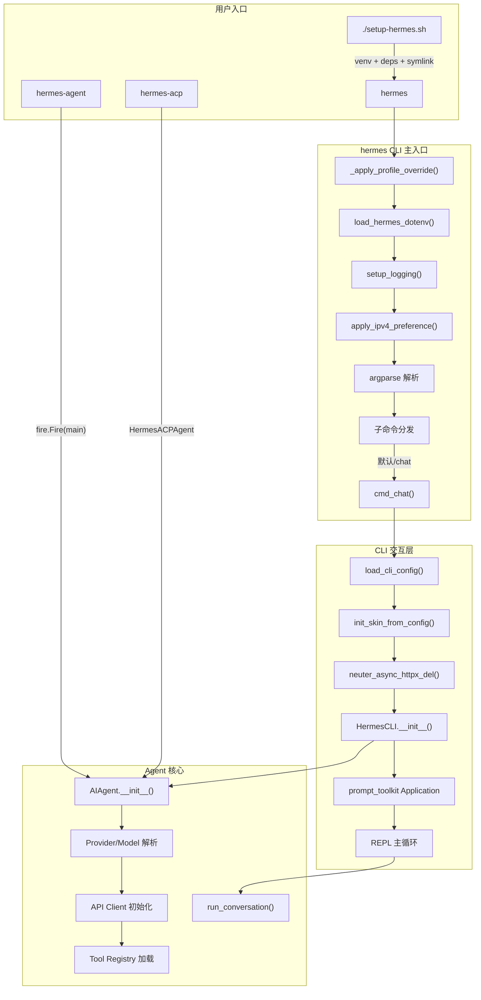
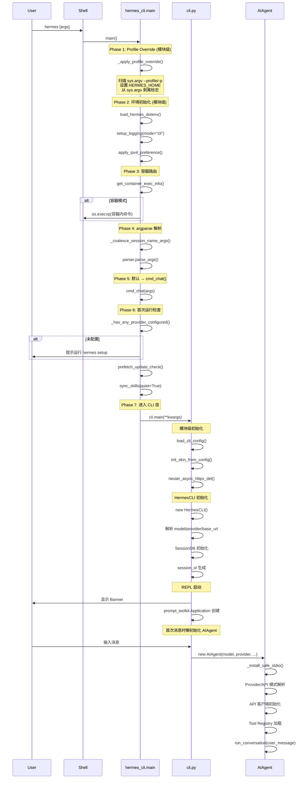

# Hermes Agent — 入口点与启动流程深度分析

## 1. 概述

Hermes Agent 提供三个独立的可执行入口，通过 `pyproject.toml` 的 `[project.scripts]` 注册：

| 入口命令 | 模块路径 | 用途 |
|---------|---------|------|
| `hermes` | `hermes_cli.main:main` | 主 CLI（交互式聊天 + 子命令分发） |
| `hermes-agent` | `run_agent:main` | 程序化 Agent 入口（fire CLI，单次查询） |
| `hermes-acp` | `acp_adapter.entry:main` | ACP 协议服务（编辑器集成） |

另有一个 Shell 安装脚本 `setup-hermes.sh` 负责开发环境初始化。

---

## 2. 架构图



---

## 3. 关键流程分析

### 3.1 主入口 `hermes_cli/main.py` — `main()`

**文件位置**: `hermes_cli/main.py:4836`

#### 3.1.1 Phase 1: Profile 覆盖（模块级，先于一切 import）

`_apply_profile_override()` 在 `hermes_cli/main.py:83` 被调用，位于第 138 行（模块级代码），在任何 hermes 业务模块 import 之前执行。

**流程**:
1. 手动扫描 `sys.argv[1:]` 查找 `--profile/-p` 标志
2. 若无显式标志，读取 `~/.hermes/active_profile` 文件查找 sticky 默认
3. 通过 `resolve_profile_env()` 将 profile 名称映射为 `HERMES_HOME` 目录路径
4. 设置 `os.environ["HERMES_HOME"]`
5. 从 `sys.argv` 中剥离 `--profile` 参数，避免 argparse 报错

**设计意图**: 许多模块在 import 时缓存 `HERMES_HOME`（模块级常量），因此必须在其 import 之前设置环境变量。

#### 3.1.2 Phase 2: 环境初始化（模块级）

按顺序执行：

| 步骤 | 代码位置 | 说明 |
|------|---------|------|
| 加载 .env | `main.py:142-144` | `load_hermes_dotenv()` 先加载 `~/.hermes/.env`，再加载项目根 `.env` |
| 文件日志 | `main.py:148-152` | `setup_logging(mode="cli")` — best-effort，失败不崩溃 |
| IPv4 偏好 | `main.py:155-164` | 读取 `network.force_ipv4` 配置，调用 `apply_ipv4_preference()` — best-effort |

#### 3.1.3 Phase 3: 容器路由（`main()` 函数内）

`main.py:6467-6472`: 调用 `get_container_exec_info()`，若检测到 NixOS 容器模式，则 `os.execvp` 将整个进程替换为容器内执行。这发生在 `parse_args()` 之前，确保所有子命令（包括 `--help`）都被透明转发。

#### 3.1.4 Phase 4: argparse 解析

`main.py:4838-5022`: 使用标准 `argparse` 构建子命令系统。

- 全局参数: `--version`, `--resume/-r`, `--continue/-c`, `--worktree/-w`, `--skills/-s`, `--yolo`, `--pass-session-id`
- 子命令: `chat`, `model`, `gateway`, `setup`, `sessions`, `auth`, `tools`, `skills`, `config`, `profile`, `completion`, `dashboard`, `logs`, `whatsapp`, `cron`, `doctor`, `status`, `version`, `update`, `uninstall`, `honcho`, `claw`, `insights`, `debug`
- 每个 `subparser.set_defaults(func=cmd_xxx)` 将子命令路由到对应处理函数

**特殊处理** (`main.py:6474-6510`):
- `_coalesce_session_name_args()`: 合并 `-c` 后的多词会话名为单 token
- argparse bpo-9338 workaround: 处理 Python <3.11 下 `nargs='?'` 与子命令冲突的问题，通过两轮解析确保正确路由

#### 3.1.5 Phase 5: 默认行为与分发

`main.py:6517-6548`:
- 若有 `--resume` 或 `--continue` 但无子命令 → 自动路由到 `cmd_chat()`
- 若无子命令 → 默认路由到 `cmd_chat()`（交互式聊天）

#### 3.1.6 Phase 6: `cmd_chat()` 启动链

`main.py:676-783`:

1. 解析 `--continue` 为 `--resume`（按名称或最近会话）
2. 首次运行守卫: `_has_any_provider_configured()` 检查 API 密钥
3. 后台预取更新检查: `prefetch_update_check()`
4. 同步打包技能: `sync_skills(quiet=True)`
5. `--yolo` → 设置 `HERMES_YOLO_MODE` 环境变量
6. 构建参数 kwargs 并调用 `cli.main(**kwargs)`

---

### 3.2 Agent 入口 `run_agent.py` — `main()`

**文件位置**: `run_agent.py:11388`

#### 3.2.1 模块级初始化

`run_agent.py:46-59`: 在模块 import 时即加载 `.env`（通过 `load_hermes_dotenv()`），与 `hermes_cli/main.py` 独立执行相同逻辑。

#### 3.2.2 `main()` 函数（fire CLI）

使用 `fire.Fire(main)` 注册，参数均为基本类型：

| 参数 | 默认值 | 说明 |
|------|-------|------|
| `query` | None | 自然语言查询 |
| `model` | "" | 模型名称 |
| `api_key` | None | API 密钥 |
| `base_url` | "" | API 基础 URL |
| `max_turns` | 10 | 最大迭代次数 |
| `enabled_toolsets` | None | 逗号分隔的工具集 |
| `disabled_toolsets` | None | 禁用的工具集 |
| `list_tools` | False | 列出可用工具 |
| `save_trajectories` | False | 保存轨迹 |
| `verbose` | False | 详细日志 |

**流程**: 直接实例化 `AIAgent` 并调用 `agent.run_conversation(query)`。无 Profile 覆盖、无交互式 UI、无 Skin 引擎。

#### 3.2.3 `AIAgent.__init__()`

`run_agent.py:552-609`（签名），完整实现至约 950 行。

关键初始化步骤：

1. **Safe stdio**: `_install_safe_stdio()` — 包装 stdout/stderr 防止管道断开崩溃
2. **迭代预算**: `IterationBudget(max_iterations)` — 线程安全计数器
3. **Provider/API 模式解析**: 通过 base_url 和 provider 自动推断 `api_mode`（`chat_completions` | `codex_responses` | `anthropic_messages` | `bedrock_converse`）
4. **模型标准化**: `normalize_model_for_provider()` 适配 provider 特定模型名
5. **API 客户端初始化**: 根据 `api_mode` 选择:
   - `anthropic_messages` → `Anthropic` 原生 SDK
   - `bedrock_converse` → `boto3` 直接调用
   - `codex_responses` → OpenAI Responses API
   - `chat_completions` (默认) → 标准 OpenAI 兼容客户端
6. **Prompt 缓存**: 自动为 OpenRouter + Claude 或原生 Anthropic 启用
7. **OpenRouter 元数据预热**: 后台线程预取模型元数据
8. **大量回调注册**: `tool_progress_callback`, `clarify_callback`, `step_callback`, `stream_delta_callback` 等 9 个回调槽位

---

### 3.3 CLI 交互入口 `cli.py` — `HermesCLI`

**文件位置**: `cli.py:1590`

#### 3.3.1 模块级初始化（import 时执行）

| 步骤 | 代码位置 | 说明 |
|------|---------|------|
| 加载 .env | `cli.py:73-78` | `load_hermes_dotenv()` |
| `load_cli_config()` | `cli.py:192-533` → `536` | 合并 YAML 配置 + 环境变量 + 默认值，桥接到 env var |
| 日志初始化 | `cli.py:540-544` | `setup_logging(mode="cli")` |
| 配置校验 | `cli.py:547-551` | `print_config_warnings()` |
| Skin 引擎 | `cli.py:554-558` | `init_skin_from_config(CLI_CONFIG)` |
| 工具预览长度 | `cli.py:562-566` | `set_tool_preview_max_len()` |
| neuter httpx | `cli.py:573-577` | `neuter_async_httpx_del()` — 修复 prompt_toolkit 事件循环冲突 |

#### 3.3.2 `load_cli_config()` 详解

`cli.py:192-533`:

**配置优先级**: CLI 参数 > 环境变量 > `~/.hermes/config.yaml` > `cli-config.yaml` > 硬编码默认值

关键合并逻辑:
- `model` 字段兼容两种格式: 字符串（新版）或字典（旧版 `model.default/base_url/provider`）
- `terminal` 配置双向桥接: YAML → 环境变量（`TERMINAL_ENV`, `TERMINAL_CWD` 等）
- `auxiliary` 配置: vision/web_extract/approval 各自拥有独立的 provider/model/base_url/api_key 元组
- `${ENV_VAR}` 引用展开: `_expand_env_vars()` 处理配置值中的环境变量替换
- `cwd` 特殊处理: `"."`/`"auto"` 对 `local` 后端解析为 `os.getcwd()`，远程后端删除

#### 3.3.3 `HermesCLI.__init__()` 详解

`cli.py:1598-1839`:

核心初始化步骤:

1. **Rich Console**: `Console()` 用于美化输出
2. **模型解析**: CLI 参数 > config.yaml > 环境变量，支持本地服务器自动检测
3. **Provider 延迟解析**: `requested_provider` 记录用户意图，`_ensure_runtime_credentials()` 在首次使用时解析
4. **API Key 智能匹配**: OpenRouter URL 优先用 `OPENROUTER_API_KEY`，自定义端点优先用 `OPENAI_API_KEY`
5. **Max turns 优先级链**: CLI 参数 > config `agent.max_turns` > 根级 `max_turns` > `HERMES_MAX_ITERATIONS` > 默认 90
6. **Toolset 校验**: 检查传入的 toolset 名称有效性，跳过未在 MCP 注册的服务器名
7. **Session 初始化**: 生成 `{timestamp}_{uuid[:6]}` 格式的 session_id，或使用 resume 指定的 ID
8. **回调/状态**: 初始化中断队列、审批锁、spinne 状态等交互基础设施

---

### 3.4 ACP 入口 `acp_adapter/entry.py`

**文件位置**: `acp_adapter/entry.py:58`

最简入口：

1. `_setup_logging()` — 路由日志到 stderr（stdout 保留给 ACP JSON-RPC）
2. `_load_env()` — 加载 `~/.hermes/.env`
3. 添加项目根到 `sys.path`
4. 实例化 `HermesACPAgent()`
5. `asyncio.run(acp.run_agent(agent, use_unstable_protocol=True))`

无 Profile 覆盖、无 argparse、无 Skin 引擎。

---

### 3.5 安装脚本 `setup-hermes.sh`

**文件位置**: `setup-hermes.sh`

开发环境一键安装脚本，流程：

1. **检测 uv**: 优先使用 `uv`，Termux 环境退化为 `stdlib venv + pip`
2. **Python 版本检查**: 要求 3.11+
3. **创建 venv**: `uv venv` 或 `python -m venv`
4. **安装依赖**: 优先 `uv sync --all-extras --locked`（哈希验证），退化到 `pip install -e ".[all]"`
5. **可选子模块**: tinker-atropos（RL 训练后端）
6. **ripgrep 安装**: 可选，用于更快的文件搜索
7. **创建 .env**: 从 `.env.example` 模板
8. **PATH 设置**: 软链接 `venv/bin/hermes` → `~/.local/bin/hermes`，写入 shell rc 文件
9. **技能同步**: `tools/skills_sync.py` 将打包技能复制到 `~/.hermes/skills/`
10. **运行 setup wizard**: 可选，交互式配置

---

## 4. 完整启动流程图（`hermes` 命令 → Agent 运行）



---

## 5. 代码质量评估

### 5.1 问题与风险点

| 编号 | 严重度 | 位置 | 描述 |
|------|--------|------|------|
| R1 | **高** | `hermes_cli/main.py:83-137` | `_apply_profile_override()` 使用手写 argv 扫描而非 argparse，逻辑脆弱。`--profile=` 的等号格式和 `-p` 短格式处理路径不同，可能出现边缘情况（如 `-p=value`）|
| R2 | **高** | `run_agent.py:11388` | `hermes-agent` 入口无 Profile 覆盖机制，也无 `.env` 在 Profile 路径下的加载逻辑，直接调用的用户无法享受多实例隔离 |
| R3 | **中** | `cli.py:536` | `CLI_CONFIG = load_cli_config()` 作为模块级常量在 import 时执行，包含大量环境变量写入操作。任何 `import cli` 的模块都会触发这些副作用 |
| R4 | **中** | `run_agent.py:46-59` | `run_agent.py` 模块级再次调用 `load_hermes_dotenv()`，与 `hermes_cli/main.py` 存在重复逻辑。若 `hermes-agent` 入口被直接调用，缺少 Profile 覆盖 |
| R5 | **中** | `hermes_cli/main.py:6486-6510` | argparse bpo-9338 workaround 通过 `sys.stderr = StringIO()` 吞掉错误输出，可能掩盖真实解析问题 |
| R6 | **低** | `cli.py:540-544` | `setup_logging(mode="cli")` 在 cli.py 和 main.py 都有调用，重复但幂等 |
| R7 | **低** | `acp_adapter/entry.py` | ACP 入口完全没有 Profile 支持、IPv4 偏好、日志初始化等基础设置 |

### 5.2 架构层面问题

1. **三入口不一致**: 三个入口各自独立执行环境初始化（.env、日志、Profile），代码路径和初始化完整性差异大。`hermes` 最完整，`hermes-acp` 最简陋。

2. **模块级副作用**: `cli.py` 在 import 时执行 `load_cli_config()` 并写入环境变量，这是不可控的副作用。任何通过 `import cli` 使用其功能的代码都会触发配置加载和环境变量修改。

3. **Argparse 定义膨胀**: `hermes_cli/main.py` 的 `main()` 函数体量极大（~1700 行的参数定义和子命令处理），可读性差。大量内联 `cmd_sessions()` 等处理函数定义在 `main()` 内部闭包中。

---

## 6. 改进建议

### 6.1 统一初始化管道

将三个入口共享的初始化逻辑提取为公共函数：

```python
# hermes_cli/bootstrap.py
def bootstrap(profile_override=True, load_env=True, setup_log=True, ipv4=True):
    """Shared initialization pipeline for all hermes entry points."""
    if profile_override:
        _apply_profile_override()
    if load_env:
        load_hermes_dotenv(...)
    if setup_log:
        setup_logging(...)
    if ipv4:
        apply_ipv4_preference(...)
```

三个入口统一调用 `bootstrap()`，避免遗漏和不一致。

### 6.2 为 `hermes-agent` 添加 Profile 支持

在 `run_agent.py:main()` 函数开头调用 `_apply_profile_override()`，使程序化入口也能享受多实例隔离。

### 6.3 消除模块级副作用

将 `cli.py` 的 `CLI_CONFIG = load_cli_config()` 改为延迟初始化：

```python
_CLI_CONFIG = None

def get_cli_config():
    global _CLI_CONFIG
    if _CLI_CONFIG is None:
        _CLI_CONFIG = load_cli_config()
    return _CLI_CONFIG
```

### 6.4 拆分 argparse 定义

将 `main()` 中的子命令注册抽取到独立模块或数据驱动结构：

```python
# hermes_cli/cli_commands.py
COMMAND_REGISTRY = [
    CommandDef(name="chat", handler=cmd_chat, parser_factory=build_chat_parser),
    CommandDef(name="model", handler=cmd_model, parser_factory=build_model_parser),
    ...
]
```

### 6.5 内联闭包提取

`cmd_sessions()` 等定义在 `main()` 内部的处理函数应提取为模块级函数，减少 `main()` 的缩进层级和认知负载。

---

## 7. 关键代码位置索引

| 文件 | 行号 | 内容 |
|------|------|------|
| `hermes_cli/main.py` | 83-137 | `_apply_profile_override()` — Profile 覆盖机制 |
| `hermes_cli/main.py` | 138 | 模块级调用 `_apply_profile_override()` |
| `hermes_cli/main.py` | 142-164 | 环境初始化（.env、日志、IPv4） |
| `hermes_cli/main.py` | 4836-5135 | `main()` — argparse 定义 |
| `hermes_cli/main.py` | 6467-6472 | 容器路由 |
| `hermes_cli/main.py` | 6474-6510 | argparse bpo-9338 workaround |
| `hermes_cli/main.py` | 6517-6548 | 默认路由 → `cmd_chat()` |
| `hermes_cli/main.py` | 676-783 | `cmd_chat()` — CLI 启动链 |
| `cli.py` | 192-533 | `load_cli_config()` — 配置合并与桥接 |
| `cli.py` | 536 | `CLI_CONFIG = load_cli_config()` — 模块级副作用 |
| `cli.py` | 554-558 | Skin 引擎初始化 |
| `cli.py` | 1590-1839 | `HermesCLI.__init__()` |
| `run_agent.py` | 46-59 | 模块级 .env 加载 |
| `run_agent.py` | 535-609 | `AIAgent.__init__()` 签名 |
| `run_agent.py` | 551-950 | `AIAgent.__init__()` 实现 |
| `run_agent.py` | 11388-11603 | `main()` — fire CLI 入口 |
| `acp_adapter/entry.py` | 58-81 | ACP 入口 `main()` |
| `pyproject.toml` | 117-120 | `[project.scripts]` 三入口注册 |
| `setup-hermes.sh` | 1-399 | 开发环境安装脚本 |