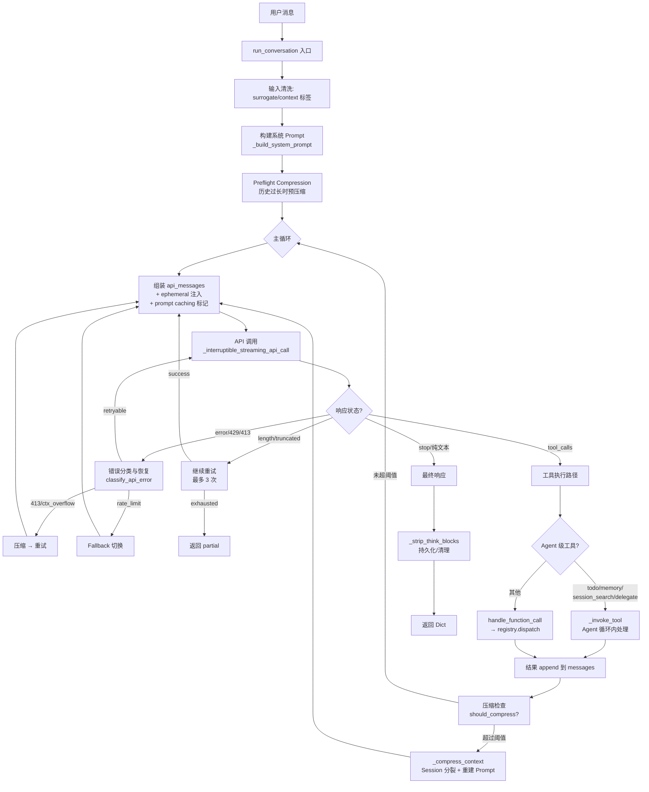

# Hermes Agent 核心数据流与消息循环深度分析

## 1. 概述

Hermes Agent 的核心是一个同步 **ReAct 循环**（Reasoning + Acting），由 `AIAgent.run_conversation()` 驱动，在用户消息和模型响应之间反复调用工具，直到模型产生最终文本响应或触发退出条件。整个数据流涉及 5 个核心模块：

| 模块 | 职责 | 行数 |
|------|------|------|
| `run_agent.py` — `run_conversation()` | 主循环：消息组装、API 调用、工具执行、退出判定 | ~3000 行（8237–11260） |
| `run_agent.py` — `_build_system_prompt()` | 系统 Prompt 分层组装（身份、记忆、技能、上下文文件、平台提示） | ~165 行（3349–3514） |
| `model_tools.py` — `handle_function_call()` | 工具分发：参数类型强制转换、插件钩子、注册表调度 | ~113 行（421–534） |
| `agent/prompt_caching.py` | Anthropic 提示缓存：system_and_3 策略，4 断点标记注入 | 72 行 |
| `agent/context_compressor.py` | 上下文压缩：工具结果裁剪 → 头/尾保护 → 中间段 LLM 摘要 | 1163 行 |

---

## 2. 架构图

### 2.1 顶层消息流

```
┌─────────────────────────────────────────────────────────────────┐
│                      run_conversation()                         │
│                                                                 │
│  ┌──────────┐    ┌──────────────┐    ┌──────────────────────┐  │
│  │ 初始化    │───→│ Preflight    │───→│ 主循环 (while)       │  │
│  │ 8237-8536│    │ Compression  │    │ 8599-11178           │  │
│  └──────────┘    │ 8445-8511    │    └──────────┬───────────┘  │
│                  └──────────────┘               │              │
│                                                 ▼              │
│                               ┌─────────────────────────────┐ │
│                               │ 1. 组装 API 消息             │ │
│                               │    - system prompt           │ │
│                               │    - ephemeral 注入          │ │
│                               │    - prompt caching 标记     │ │
│                               │    - 消息清洗/规范化         │ │
│                               └────────────┬────────────────┘ │
│                                            ▼                  │
│                               ┌─────────────────────────────┐ │
│                               │ 2. API 调用 (含重试)        │ │
│                               │    - 流式/非流式            │ │
│                               │    - 错误分类与恢复          │ │
│                               │    - 压缩触发 (413/ctx err) │ │
│                               └────────────┬────────────────┘ │
│                                            ▼                  │
│                               ┌─────────────────────────────┐ │
│                               │ 3. 响应分支                 │ │
│                               ├─────┬───────────┬───────────┤ │
│                               │tool │  length   │  stop     │ │
│                               │calls│ truncate  │ (text)    │ │
│                               └──┬──┴─────┬─────┴─────┬─────┘ │
│                                  │        │           │       │
│                    ┌─────────────┘        │           │       │
│                    ▼                      ▼           ▼       │
│          ┌──────────────┐     ┌───────────┐  ┌──────────────┐ │
│          │ 4. 执行工具   │     │ 继续/截断 │  │ 7. 最终响应 │ │
│          │    调用       │     │  处理     │  │    退出循环 │ │
│          └──────┬───────┘     └───────────┘  └──────────────┘ │
│                 │                                  │          │
│                 ▼                                  ▼          │
│          ┌──────────────┐               ┌──────────────────┐ │
│          │ 5. 结果回灌   │               │ 8. 后处理        │ │
│          │ messages     │               │ 持久化/清理/统计 │ │
│          └──────┬───────┘               └──────────────────┘ │
│                 │                                             │
│                 ▼                                             │
│          ┌──────────────┐                                     │
│          │ 6. 压缩检查  │──→ 超阈值 → _compress_context()    │
│          │  continue    │                                     │
│          └──────────────┘                                     │
└─────────────────────────────────────────────────────────────────┘
```

### 2.2 Mermaid 数据流图



---

## 3. 关键流程分析

### 3.1 AIAgent.run_conversation() 核心循环

**入口**：`run_agent.py:8237`

#### 3.1.1 初始化阶段 (8237–8598)

1. **输入清洗**：剔除 surrogate 字符（防止 JSON 序列化崩溃）、剥离泄露的 `<memory-context>` 标签
2. **系统 Prompt 缓存**：首次构建后缓存到 `_cached_system_prompt`，后续会话复用（保护 Anthropic 前缀缓存）
3. **Preflight 压缩**：加载历史后若已超阈值（含 tool schema tokens 估算），执行最多 3 轮预压缩
4. **外部记忆预取**：`memory_manager.prefetch_all()` 在循环前调用一次，后续迭代复用缓存

#### 3.1.2 主循环条件 (8599)

```python
while (api_call_count < self.max_iterations 
       and self.iteration_budget.remaining > 0) or self._budget_grace_call:
```

**退出条件**（按优先级）：
| 条件 | 触发点 | 退出行为 |
|------|--------|----------|
| `max_iterations` (默认 90) | 8237/11179 | 额外调用 `_handle_max_iterations()` 求摘要 |
| `iteration_budget` 耗尽 | 8620-8624 | 带 grace call 的优雅退出 |
| 中断信号 `_interrupt_requested` | 8604-8609 | 保存会话，返回 interrupted=True |
| 模型返回纯文本（无 tool_calls） | 10825-11127 | 正常完成，`break` |
| 响应截断且无法恢复 | 9271-9367 | 返回 partial |
| API 重试耗尽 + 无 fallback | 9113-9130 | 返回 failed=True |
| 空/推理耗尽响应 + 重试耗尽 | 10988-11065 | 返回 "(empty)" |

#### 3.1.3 每次迭代的流程

```
1. 消息组装 (8660-8781)
   ├── 将 messages 浅拷贝为 api_messages
   ├── 注入 ephemeral 上下文到当前 user message
   ├── 传递 reasoning → reasoning_content (多轮推理保持)
   ├── 清洗 API 字段 (finish_reason, _thinking_prefill 等)
   └── 规范化 tool_call JSON (sort_keys + compact separators)

2. 系统 Prompt 注入 (8717-8732)
   ├── cached_system_prompt + ephemeral_system_prompt
   ├── prefill_messages 插入 (few-shot priming)
   └── Anthropic prompt caching 标记

3. 消息清洗 (8745-8781)
   ├── _sanitize_api_messages (orphan tool pairs)
   ├── 去首尾空白 (strip)
   └── surrogate 清理

4. API 调用 (8912-9489)
   ├── 优先流式 (健康检查 + stale-stream 检测)
   ├── 内部重试循环 (最多 3 次)
   ├── 错误分类 → 恢复策略 (压缩/fallback/凭证轮换)
   └── 成功后更新 usage 统计

5. 响应处理 (9163-11127)
   ├── finish_reason=length → 继续/截断处理
   ├── tool_calls → 验证 → 执行 → 结果回灌 → 压缩检查 → continue
   └── 纯文本 → 最终响应 → break
```

#### 3.1.4 Reasoning 处理方式

推理内容采用 **双轨存储**：

1. **消息内部**：`assistant_msg["reasoning"]` — 用于 trajectory 持久化，不发送给 API
2. **API 传输**：`api_msg["reasoning_content"]` — 从 `reasoning` 字段复制，供 OpenRouter/Moonshot 等多轮推理
3. **结构化推理**：`reasoning_details` (Anthropic/OpenRouter 签名)、`codex_reasoning_items` (Codex 加密推理) — 原样传递
4. **内嵌推理**：`<think>` / `<REASONING_SCRATCHPAD>` 标签从 content 中提取，存入 `reasoning` 字段

`_build_assistant_message()` (6874) 统一处理所有推理来源：
- 优先提取 `reasoning_content` 结构化字段
- 回退提取 content 中的 `<think>...</think>` 块
- 两者均有时取结构化字段
- 推理签名失效时 (Anthropic 400)，清除全部 `reasoning_details` 后重试

---

### 3.2 工具调用链

#### 3.2.1 分发架构

```
assistant_message.tool_calls
    │
    ▼
┌─────────────────────────────┐
│ _execute_tool_calls()        │
│  (run_agent.py:10761)        │
│  并发路径: _execute_tool_    │
│  calls_concurrent() (7438)  │
│  顺序路径: inline (legacy)   │
└──────────┬──────────────────┘
           │
           ▼
┌─────────────────────────────┐
│ _invoke_tool()               │
│  (run_agent.py:7326)         │
│  Agent 级工具分发:           │
│  ├─ todo      → _todo_tool() │
│  ├─ memory    → _memory_tool()│
│  ├─ session_search            │
│  ├─ delegate_task             │
│  ├─ clarify                   │
│  ├─ memory_manager tools      │
│  └─ 其他 → handle_function_  │
│           call()              │
└──────────┬──────────────────┘
           │
           ▼
┌─────────────────────────────┐
│ handle_function_call()       │
│  (model_tools.py:421)        │
│  ├─ coerce_tool_args()       │
│  │   类型强制: "42"→42       │
│  ├─ 插件 pre_tool_call 钩子   │
│  ├─ read/search 计数通知     │
│  ├─ Agent 级工具拦截:         │
│  │   _AGENT_LOOP_TOOLS =     │
│  │   {todo,memory,           │
│  │    session_search,        │
│  │    delegate_task}          │
│  └─ registry.dispatch()      │
│     → tools/*.py handler      │
└──────────┬──────────────────┘
           │
           ▼
     Tool Result (JSON string)
           │
           ▼
┌─────────────────────────────┐
│ 结果回灌到 messages          │
│ {"role":"tool",              │
│  "tool_call_id":"...",       │
│  "content": result}          │
└─────────────────────────────┘
```

#### 3.2.2 Agent 级工具拦截模式

`_AGENT_LOOP_TOOLS = {"todo", "memory", "session_search", "delegate_task"}` (model_tools.py:326)

这些工具需要 Agent 级状态（TodoStore、MemoryStore、SessionDB），因此：

1. **注册表**仍持有它们的 schema（供 LLM 发现）
2. **`handle_function_call()`** 拦截它们并返回 `{"error": "must be handled by the agent loop"}`
3. **`_invoke_tool()`** 在 Agent 循环内直接分发到各自 handler
4. 对 `delegate_task`：子代理继承 `parent_agent` 引用，执行完毕后结果序列化回传

这种模式避免了注册表对 Agent 状态的耦合，同时保证了 tool schema 的完整性。

#### 3.2.3 `_last_resolved_tool_names` 全局变量

`model_tools.py:159` — 进程级全局变量，记录最近一次 `get_tool_definitions()` 调用解析出的工具名列表。

**用途**：`execute_code` 工具需要知道当前会话有哪些工具，以生成沙箱内的工具 schema。`handle_function_call()` 优先使用 `enabled_tools` 参数（由 `_invoke_tool` 传入 `self.valid_tool_names`），当参数为 None 时降级到全局变量。

**风险**：在 `delegate_tool.py` 的 `_run_single_child()` 中，子代理执行前会保存/恢复此全局变量，防止并发子代理相互覆盖。但若非 delegate 路径的并发执行修改此变量，会造成竞争。

---

### 3.3 Prompt 构建与缓存

#### 3.3.1 系统 Prompt 分层组装

`_build_system_prompt()` (3349–3514) 按以下层级拼接：

```
1. Agent Identity    → SOUL.md 或 DEFAULT_AGENT_IDENTITY
2. Tool Guidance     → memory/session_search/skills 指引 (按工具可用性)
3. Nous Subscription  → 订阅式工具提示
4. Tool Enforcement   → 强制工具使用指导 (按模型匹配)
   ├─ TOOL_USE_ENFORCEMENT_MODELS
   ├─ GOOGLE_MODEL_OPERATIONAL_GUIDANCE
   └─ OPENAI_MODEL_EXECUTION_GUIDANCE
5. Custom System     → 用户/gateway 提供的 system_message
6. Memory            → _memory_store.format_for_system_prompt()
7. User Profile      → USER.md
8. External Memory   → _memory_manager.build_system_prompt()
9. Skills Index      → build_skills_system_prompt()
10. Context Files     → AGENTS.md, .cursorrules, .hermes.md
11. Timestamp        → 会话开始时间 + Session ID + Model + Provider
12. Alibaba 修复     → API 返回错误模型名的 workaround
13. Environment Hints → WSL/Termux 等环境提示
14. Platform Hints    → telegram/discord/slack 等格式提示
```

**关键设计**：
- 上下文文件扫描含 **注入攻击检测** (`_CONTEXT_THREAT_PATTERNS`，prompt_builder.py:36-52)
- `ephemeral_system_prompt` **不在此处注入**，而是在 API 调用时叠加，保护缓存前缀

#### 3.3.2 Prompt 缓存策略

`apply_anthropic_cache_control()` (prompt_caching.py:41-71)

**system_and_3 策略**（Anthropic 最多 4 个断点）：

```
[system]  ← cache_control (断点 1)
[user]    
[assistant]
[tool]
[user]    ← cache_control (断点 2)
[assistant]
[tool]
[assistant] ← cache_control (断点 3)
[tool]    ← cache_control (断点 4)
```

- **断点 1**：系统 prompt（最稳定，跨轮次不变）
- **断点 2-4**：最后 3 条非 system 消息（滚动窗口）

**实现细节**：
- 对 `role=tool` 的消息：`native_anthropic=True` 时加在消息本身，否则不加（API 不支持）
- 对 `content=""` 的空消息：加在消息顶层
- 对 `content=string` 的消息：转换为 `[{"type":"text","text":...,"cache_control":...}]`
- 对 `content=list` 的消息：加在最后一个 content block 上
- **深拷贝**：每次调用 `copy.deepcopy(api_messages)` 避免修改原始消息

#### 3.3.3 上下文压缩

**触发条件**：

1. **Preflight** (8445)：历史消息加载后，`estimate_request_tokens_rough()` 含 tool schema，超过阈值则压缩
2. **API 错误触发**：413 (payload too large)、context overflow error、long-context tier gate
3. **轮次内触发** (10806)：每次工具执行后调用 `should_compress(real_tokens)`

**压缩算法** (`ContextCompressor.compress()`, 999-1163)：

```
Phase 1: _prune_old_tool_results()
  ├── Pass 1: 内容去重 (相同 hash 的重复结果只保留最新)
  ├── Pass 2: 信息性裁剪 (>200字符 → 单行摘要)
  └── Pass 3: assistant tool_call 参数截断 (>500字符 → 200+...[truncated])

Phase 2: 确定边界
  ├── compress_start = protect_first_n (默认 3) → 向前对齐跳过 tool 结果
  └── compress_end = _find_tail_cut_by_tokens()
      ├── 从末尾向前累加 tokens <= tail_token_budget
      ├── 最低保护 3 条消息
      ├── 软上限 1.5x budget (避免裁剪超大消息)
      └── _ensure_last_user_message_in_tail (修复 #10896: 不丢失最新用户消息)

Phase 3: _generate_summary()
  ├── 首次压缩: 结构化模板 (Active Task/Goal/Progress/...)
  ├── 迭代更新: 保留旧摘要 + 合入新 turns
  ├── 支持 focus_topic (用户指定 /compress <topic>)
  ├── 失败回退: 60s (瞬态) / 600s (无 provider) 冷却
  └── 摘要模型降级: 404/503 → 降级到主模型

Phase 4: 组装
  ├── head (0..compress_start) + 保留
  ├── summary (一条 user/assistant 消息，角色避免连续重复)
  ├── tail (compress_end..end) + 保留
  ├── _sanitize_tool_pairs() (orphan 检测 + stub 补全)
  └── 反抖动: 连续 2 次压缩节省 <10% → 暂停压缩
```

#### 3.3.4 压缩后连贯性保持与缓存风险

**连贯性机制**：
- `SUMMARY_PREFIX` 明确告知模型：这是参考材料，不要回答摘要中的问题，只响应摘要后的用户消息
- "Active Task" 字段保存用户最新未完成请求的原词
- "Completed Actions" 保留工具调用细节（文件路径、命令、行号）
- 迭代摘要：不丢弃旧摘要，而是在此基础上增量更新

**缓存断链风险点**：
1. **系统 Prompt 重建**：`_compress_context()` (7201) 调用 `_invalidate_system_prompt()` + `_build_system_prompt()` → 新 prompt 与旧 prompt 不同，Anthropic 前缀缓存失效
2. **Session 分裂**：压缩创建新 session_id (7247)，旧 session 标记 "compression"
3. **orphan tool pairs**：压缩移除中间 assistant+tool 分组后，残留的 tool_call_id 无匹配 → `_sanitize_tool_pairs()` 补 stub 结果
4. **最差情况**：连续压缩 + API 错误 → 多次重建 prompt → 每次重建都使缓存失效 → 成本飙升

---

## 4. 消息格式

所有消息遵循 **OpenAI Chat Completions 格式**：

```python
# System
{"role": "system", "content": "..."}  # 或 content=[{"type":"text","text":"...","cache_control":{}}]

# User
{"role": "user", "content": "..."}

# Assistant (纯文本)
{"role": "assistant", "content": "...", "reasoning": "...", "finish_reason": "stop"}

# Assistant (带工具调用)
{"role": "assistant", "content": "...", "tool_calls": [
    {"id": "...", "call_id": "...", "type": "function",
     "function": {"name": "...", "arguments": "{\"key\":\"value\"}"},
     "extra_content": {...}  # Gemini thought_signature 等
], "reasoning": "...", "reasoning_details": [...],
 "codex_reasoning_items": [...], "finish_reason": "tool_calls"}

# Tool Result
{"role": "tool", "tool_call_id": "...", "content": "{\"success\":true,...}"}
```

`_build_assistant_message()` (6874) 统一构建，处理：
- reasoning 提取（结构化 → 内嵌 `<think>` 回退）
- reasoning_details 保留（Anthropic/OpenRouter 签名）
- codex_reasoning_items 保留
- tool_call ID 规范化（deterministic_call_id 降级）
- extra_content 保留（Gemini thought_signature）

---

## 5. 代码质量评估

### 5.1 问题

| # | 问题 | 位置 | 严重度 |
|---|------|------|--------|
| 1 | **run_conversation() 过长** | 8237-11260 (~3000 行) | 高 |
| 2 | **主循环嵌套过深** | 外层 while + 内层 retry while + 分支 if/elif | 高 |
| 3 | **状态变量爆炸** | 每轮重置 ~18 个 `_xxx_retries/_xxx_count` (8304-8316) | 中 |
| 4 | **错误恢复路径与正常路径交织** | Unicode/413/429/fallback 处理嵌入主循环 | 高 |
| 5 | **`_last_resolved_tool_names` 全局状态** | model_tools.py:159 — 进程全局，子代理需手动保存/恢复 | 中 |
| 6 | **`_AGENT_LOOP_TOOLS` 双重入口** | handle_function_call 和 _invoke_tool 都拦截，存在遗漏窗口 | 低 |
| 7 | **api_messages 重建开销** | 每次迭代 deep copy + 序列化 tool_call JSON | 低 |

### 5.2 风险点

1. **Anthropic 前缀缓存失效链**：任何压缩事件都会触发系统 Prompt 重建（含 memory 变更、context file 变更），使跨轮次缓存完全失效。在一次长会话中，如果频繁触发压缩，token 成本可达到理论最低值的 4-5 倍。

2. **压缩后 orphans 传播**：虽然 `_sanitize_tool_pairs()` 和 `_sanitize_api_messages()` 都做了 orphans 修补，但如果上游压缩逻辑的边界对齐（`_align_boundary_forward/backward`）产生 off-by-one，stub 结果会被持久化到 session DB，无法恢复。

3. **并发工具执行中的 `self` 状态修改**：`_execute_tool_calls_concurrent()` (7438) 使用 ThreadPoolExecutor 并行调用 `_invoke_tool()`，其中 memory/todo 操作直接修改 `self._memory_store` / `self._todo_store`，无锁保护。高并发场景下可能产生数据竞争。

4. **重试与压缩的反馈循环**：413 → 压缩 → 重建 prompt → 重试 → 新 prompt 更短但仍 413 → 再次压缩 → 反抖动保护生效 → 放弃。这是正确行为，但每次压缩的 LLM 摘要调用是额外成本，且冷却期（60s/600s）期间可能错过更优的压缩时机。

5. **`should_compress()` 的 token 来源不一致**：Preflight 用 `estimate_request_tokens_rough()`（含 tool schema），轮次内用 `response.usage.prompt_tokens`（API 实测），两者差距可达 20-30K tokens（大量工具场景），可能导致 Preflight 过度压缩或轮次内压缩滞后。

### 5.3 设计亮点

1. **系统 Prompt 缓存策略**：首次构建 → session DB 存储 → 续接会话复用，确保 Anthropic prefix cache 最大命中率
2. **Ephemeral-only 注入**：plugin context / memory prefetch / ephemeral_system_prompt 全部在 API 调用时注入，永不持久化到 session DB，保护缓存前缀
3. **迭代摘要**：不丢弃旧摘要，增量更新，信息损失随压缩次数递减
4. **工具结果信息性裁剪**：用 `_summarize_tool_result()` 生成单行摘要而非通用占位符，压缩后模型仍能判断工具做了什么
5. **Anti-thrashing**：连续 2 次压缩节省 <10% 时暂停，避免无限压缩循环
6. **Grace call**：budget 耗尽前给模型最后一次机会（无工具），请求摘要而非硬停
7. **错误分类器**（`agent/error_classifier.py`）：结构化分类 API 错误 → 决定压缩/fallback/重试策略，避免一刀切

---

## 6. 改进建议

### 6.1 结构重构（高优先级）

1. **拆分 `run_conversation()` 为多个方法**：
   - `_prepare_turn()` — 初始化/清洗/预压缩
   - `_build_api_messages()` — 消息组装/注入/缓存标记
   - `_handle_response()` — 响应分支处理
   - `_handle_error()` — 错误分类与恢复
   - `_finalize_turn()` — 持久化/清理
   - 目标：主循环体 < 100 行

2. **提取错误恢复策略为策略模式**：
   ```python
   class ErrorRecoveryStrategy:
       def should_apply(cls, error) -> bool: ...
       def apply(cls, agent, error) -> RecoveryAction: ...
   ```
   每种错误类型（413、429、Unicode、context_overflow）注册独立策略，从主循环中剥离 ~800 行错误处理代码。

3. **状态变量封装**：
   ```python
   @dataclass
   class TurnState:
       invalid_tool_retries: int = 0
       invalid_json_retries: int = 0
       empty_content_retries: int = 0
       thinking_prefill_retries: int = 0
       ...
   ```
   每轮新建 `TurnState`，替代 18+ 个 `self._xxx` 变量。

### 6.2 缓存保护（中优先级）

4. **压缩后延迟 Prompt 重建**：如果压缩前后 memory/context file 未变化，仅更新压缩标记而保持 Prompt 内容不变，让 Anthropic 缓存部分命中。需要 `prompt_builder` 支持 diff 式更新。

5. **`should_compress()` token 来源统一**：轮次内也使用 `estimate_request_tokens_rough()` 或将 tool schema tokens 纳入 `context_compressor.last_prompt_tokens`，消除 20-30K 的估算偏差。

### 6.3 并发安全（中优先级）

6. **`_last_resolved_tool_names` 消除全局依赖**：将 enabled_tools 列表作为显式参数传递给所有需要的工具 handler（execute_code 已支持 `enabled_tools` 参数），废弃全局变量 fallback。

7. **并发工具执行的内存操作加锁**：`_execute_tool_calls_concurrent()` 中 memory/todo 操作应串行化或使用 lock。最简方案：housekeeping 工具（memory/todo/skill_manage）始终串行执行，仅并行化 IO 工具。

### 6.4 可观测性（低优先级）

8. **压缩事件结构化日志**：每次压缩输出 JSON 格式的 metrics（压缩前/后消息数、tokens、耗时、摘要模型），便于离线分析压缩质量。

9. **退出原因指标化**：`_turn_exit_reason` 已有（8558），但未持久化到 session DB。添加到 `update_token_counts()` 可在 `/insights` 中展示会话终止原因分布。